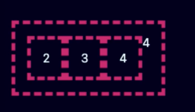
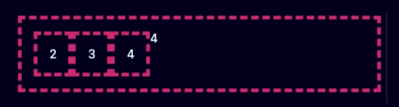
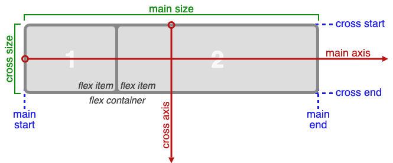
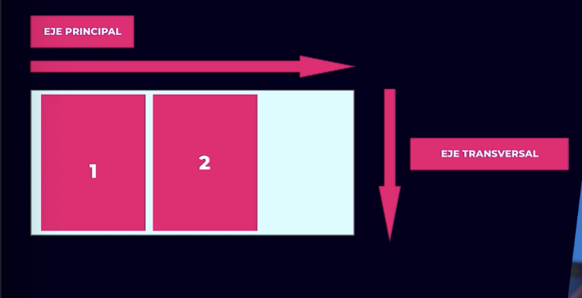
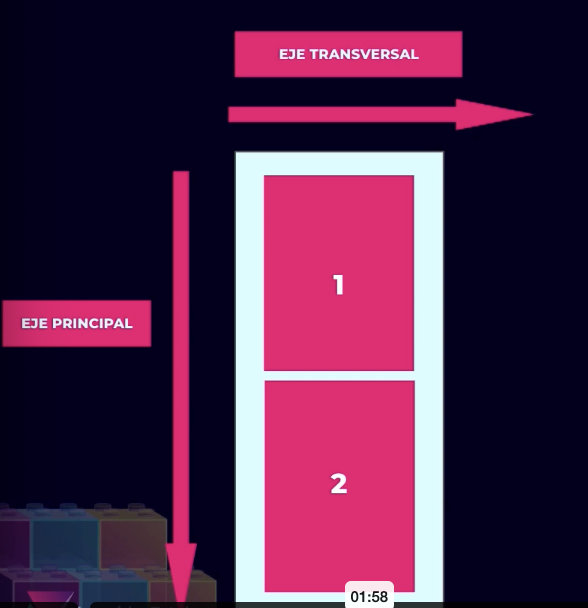
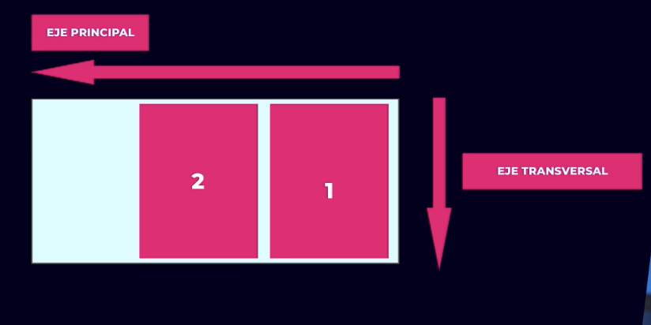
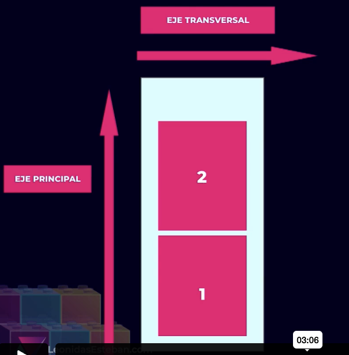
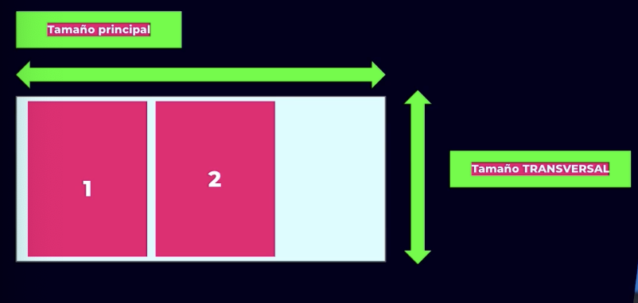

## Instalar extensiones

- Css peek, para poder hacer un go to a la clase.
- IntelliSense for CSS class names in HTML, autocompletado de las clases.
- Landmarks Secciones importantes de nuestro html.

## Problemas en nuestro codigo actual
- Archivos de estilos extenso
- Selectores, archivos y hojas de estilos sin reglas claras
- Debemos de crear convenciones para poderlo trabajar con el equipo

## ¿Qué es un componente?
Un componente es una parte independiente, que realiza una funcion especifica. Pero existen componentes mas sofisticados (mas elaborados) que se componen de varios componentes.

## Convenciones de nombres populares en CSS

Convenciones de nombre para css:
1. BEM
```css
  .block
  .my-block
  .my-block__element
  .my-block__fancy-element
  .my-block__element--modifier
  .my-block__fancy-element--modifier
```
2. SuitCSS
```css
  MyComponent
  MyComponent-part
  MyComponent-anotherPart
  MyComponent--modifier
  is-state
  u-utily
```
3. SMACSS
4. Atomic

Nosotros ocuparemos una combinación entre BEM SUITCSS

[Recurso BEM](https://www.freecodecamp.org/espanol/news/convenciones-de-nomenclatura-de-css-que-te-ahorraran-horas-de-depuracion/)

## Convenciones para este curso

- No se escribiran estilos globales a excepcion de las configuraciones y theme de la aplicacion
- Las clases seran basadas en componentes y no se deberan repetir
- Una hoja de estilos por componente
- Los componentes no deben tener depedencias externas
- Los archivos se escribiran ***kebab-case***

Se utilizara en kebab-case, porque en mac no diferencia entre mayusculas o minusculas, pero cuando lo subamos a un servidor linux nos puede traer problemas ya que el S.O linux distingue en mayuculas y minusculas.

## Flexible Box Layout Module
Las propiedades usadas son display:flex y display:inline-flex, se comporta como elementos en bloque y elementos en linea.

La diferencia  es que el flex container agrupa a los elementos.

El contenedor se llamaria flex container y los elementos hijos serian los flex items.

```css
<div class="box">
  <div class="box"></div>
  <div class="box"></div>
  <div class="box"></div>
</div>
```

#### display: inline-flex


#### display: flex



## Flex Layout Box Model




### Ejes
Segun el modo se definira cual es el eje principal o eje transversal.

- Por defecto <pre>writing-mode: horizontal-tb<pre/>


- Aplicando <pre>writing-mode: vertical-rl<pre/>


- Tambien existen estas alineaciones





### Tamanos
Aqui tambien sigue el mismo patron que ejes, no existe eje x ni y.



Ejemplo:

```css
.box {
  block-size: 300px;
}

.box > .box{
  block-size: auto;
}
```

Los hijos toman el alto del padre.


### Alineaciones


